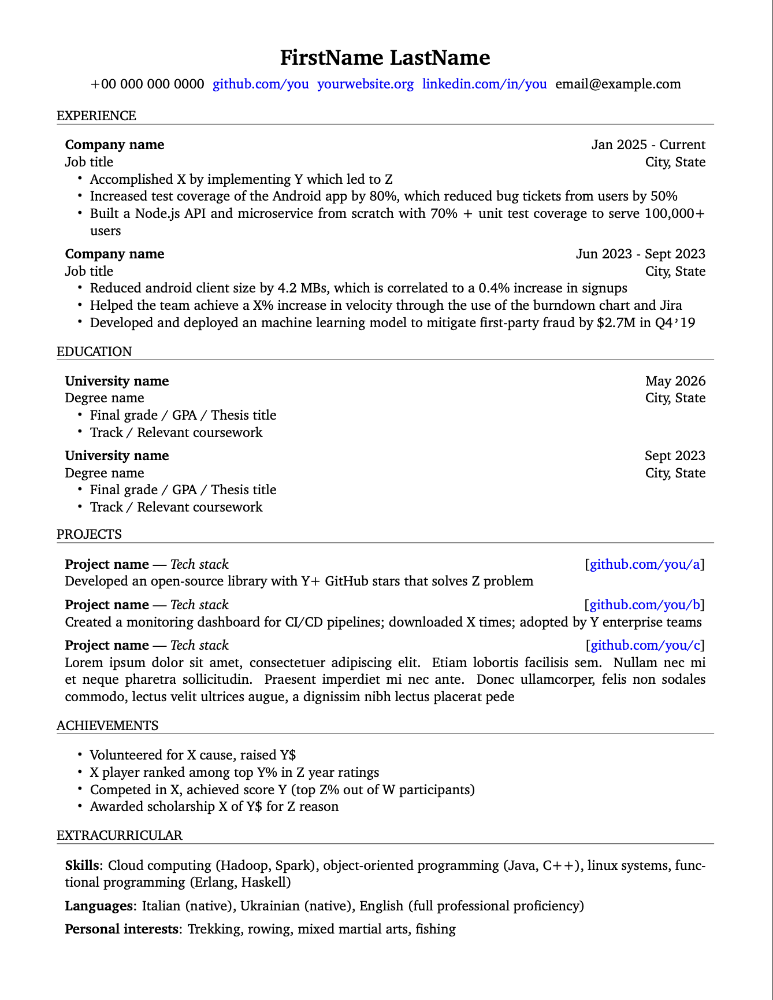

# Bare-Metal CV

Bare-Metal CV is a minimal (yet professional), beginner-friendly (for real), highly-customizable CV/resume template in ~100 lines of LaTeX

To use it, open [main.tex](main.tex) (either copy/paste or download it) in your favorite LaTeX editor (if you don't have one, use [overleaf](https://overleaf.com))



Don't believe it?

```latex
\documentclass[11pt]{article} 
\pagestyle{empty}
\setlength{\parindent}{0pt} 

\usepackage{geometry}
\usepackage{hyperref}
\usepackage{enumitem}

\geometry{
    letterpaper,
    left=0.075\paperwidth,
    right=0.075\paperwidth,
    top=0.075\paperheight,
    bottom=0.075\paperheight
}

\hypersetup{
    colorlinks=true,
    linkcolor=blue,
    urlcolor=blue
}

\setlist[itemize]{
    label=-,          
    topsep=0pt,       
    itemsep=0pt,      
    parsep=0pt,       
    leftmargin=20pt
}

\newcommand
{\newsection}[1]{
    \vspace{10pt} 
    \textbf{#1}   
    \vspace{3pt}    
    \hrule        
    \vspace{7pt}
}

\newcommand
{\smallvspace}{
    \vspace{5pt}
}
```

That's it, that's the LaTeX preamble, those are all the required settings for this template.

No obscure LaTeX packages, just geometry, hyperref and enumitem.

No weird commands, configuration settings or hard to understand syntactic sugars.

Just a single file containing ~100 lines of simple, easy to understand LaTeX code.
