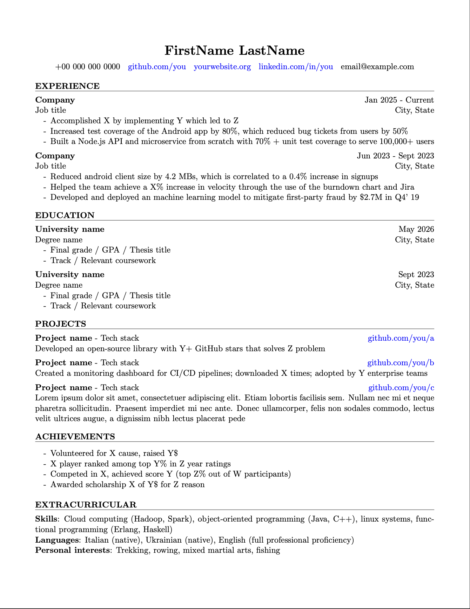

# Bare-Metal CV

Bare-Metal CV is a minimal (yet professional), beginner-friendly, highly-customizable CV/resume template in under 50 lines of LaTeX



Don't believe it?

```latex
\documentclass[11pt]{article} 
\pagestyle{empty}
\setlength{\parindent}{0pt} 

\usepackage{geometry}
\usepackage{hyperref}
\usepackage{enumitem}

\geometry{
    letterpaper,
    left=0.075\paperwidth,
    right=0.075\paperwidth,
    top=0.075\paperheight,
    bottom=0.075\paperheight
}

\hypersetup{
    colorlinks=true,
    linkcolor=blue,
    urlcolor=blue
}

\setlist[itemize]{
    label=-,          
    topsep=0pt,       
    itemsep=0pt,      
    parsep=0pt,       
    leftmargin=20pt
}

\newcommand
{\newsection}[1]{
    \vspace{10pt} 
    \textbf{#1}   
    \vspace{3pt}    
    \hrule        
    \vspace{7pt}
}

\newcommand
{\smallvspace}{
    \vspace{5pt}
}
```

That's it, that's the template. 

No obscure LaTeX packages, just geometry, hyperref and enumitem.

No weird commands or hard to understand syntactic sugars.

Just 43 lines of simple, easy to understand LaTeX code.

> (43 lines excluding the actual content and comments ~ 200 lines for a complete CV)
